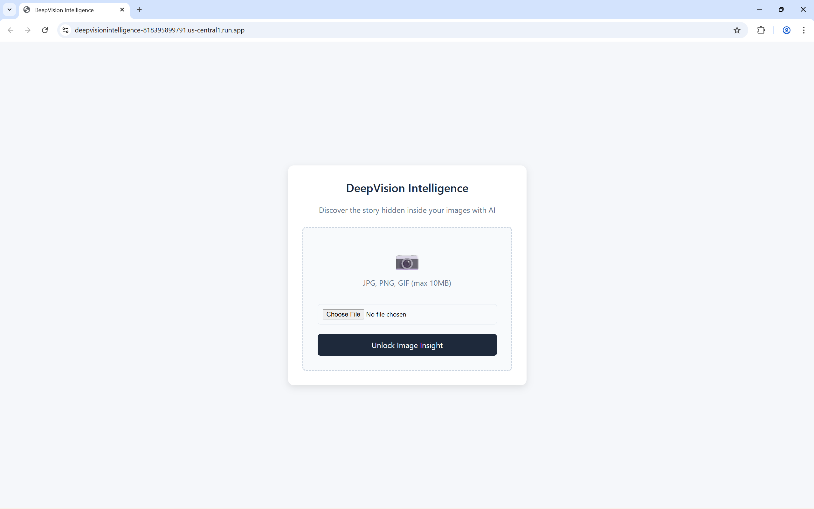
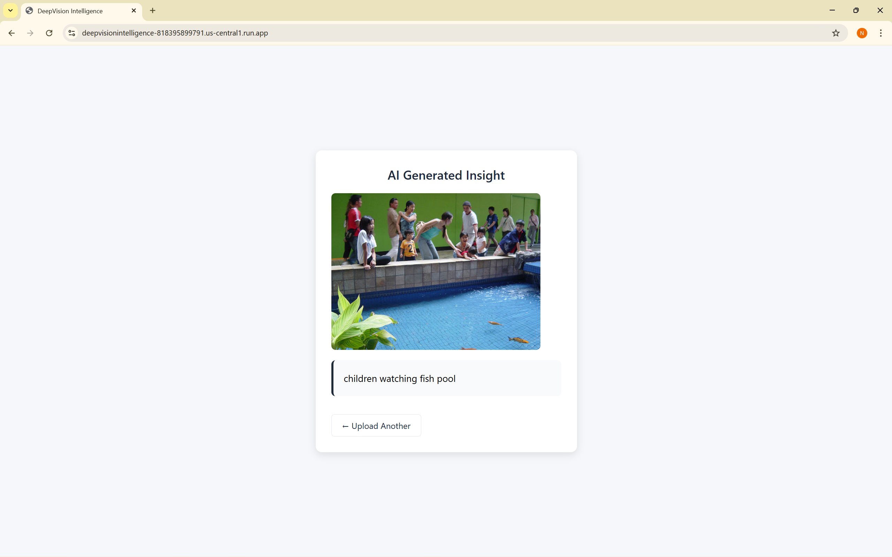

# DeepVisionIntelligence 🧠📸

## 🌟 Overview

**DeepVisionIntelligence** is an image captioning model that looks at pictures and tells you what's in them - like having a second pair of eyes. Trained on **8,000+** high-resolution images, it uses a **Transformer architecture** (the same tech behind modern language models(***LLM***)) to generate natural, accurate descriptions. From "a brown dog chasing a frisbee in the park" to "a plate of pasta with basil leaves on a wooden table" - it picks out the details, finds the right words, and turns them into proper, contextually accurate sentences.. 

**It's built end-to-end** – from training the model to deploying it live. The pipeline covers **data versioning**, **experiment tracking**, **model training**, and **automated deployment** using **MLOps practices** and **CI/CD**. Every code change triggers automated task, and the latest model gets deployed seamlessly. So you're not just getting a model – you're getting a **production-ready system** that's always up-to-date.


### ✨ Key Features

- 🖼️ **Image Upload** - click button to upload image
- 📊 **Model Versioning** - Track experiments with DVC
- ⚡ **Real-time Processing** - Fast inference with TensorFlow
- 🤖 **AI-Powered Captions** - Generates context-aware descriptions
- ⚙️ **End-to-End MLOps Pipeline** - Fully end-to-end project with **MLOps** and **CI/CD**
- ☁️ **Cloud Ready** - Used Google Cloud Platform (GCP) for DVC storage and cloud deployment

---

## 🚀 Demo

<!-- | Front Webpage | AI Caption Result |
|:---:|:---:|
|  |  | -->

| |
|:---:|
| **Front Webpage** |
|  |
| **AI Caption Result** |
|  |

---

## 🛠️ Technology Stack

| Component | Technology | Purpose |
|-----------|------------|---------|
| **AI/ML** | TensorFlow, Python, Transformer (Encoder-Decoder Architecture) | Core deep learning model for image captioning |
| **MLOps** | DVC, Git, MLflow, Docker | Experiment tracking, data versioning, model registry |
| **Cloud Platform** | Google Cloud Platform (GCP) | Cloud Run for deployment, Cloud Storage for DVC remote storage |
| **CI/CD** | GitHub Actions | Containerization and automated deployment pipeline |
| **Backend** | FastAPI | High-performance web framework |
| **Frontend** | HTML/CSS/JS | Responsive user interface |
| **Image Processing** | VGG16 | Image preprocessing and feature extraction |
| **NLP** | NLTK | Natural language processing for caption generation |


---

## 📋 Prerequisites

- Python 3.10
- pip (Python package manager)
- Git (optional, for cloning)
- Google Cloud account (optional, for remote storage)

---

## 🔧 Installation

### 1. Clone the Repository
```bash
git clone https://github.com/NavdeepSinghNegi999/DeepVisionIntelligence.git
cd DeepVisionIntelligence
```

### 2. Create Virtual Environment
```bash
# Create conda environment with Python 3.10
conda create -n deepvision python=3.10.0

# Install CUDA and cuDNN for GPU support
conda install -n deepvision cudatoolkit=11.2 cudnn=8.1 -c conda-forge

# Activate the environment
conda activate deepvision
```

### 3. Install Dependencies
```bash
pip install -r requirements/all_requirements.txt
```

### 4. Set Up DVC (Optional for Cloud Storage)
```bash
# Initialize DVC
dvc init

# Add remote storage (example: local)
dvc remote add -d localremote ./dvc-storage

# Or for Google Cloud
# dvc remote add -d gcsremote gs://your-bucket-name
```

---

## 🚀 Usage

### Start the Application
```bash
uvicorn main:app --reload
```

### Access the Web Interface
Open your browser and navigate to:
```
http://localhost:8080
```


---

## 📁 Project Structure

```
deepvisionintelligence/
├── .dvc/                       # DVC configuration
├── data/                       # Dataset files
├── logs/                       # Training logs
├── mlruns/                     # MLflow experiment tracking
├── notebooks/                  # Jupyter notebooks
├── requirements/               # Dependency files
├── src/                        # Source code
│   ├── data_component/        # Data processing modules
│   ├── evaluation/            # Evaluation metrics
│   ├── inference/             # Inference modules
│   ├── models/                # Model architectures
│   ├── training/              # Training modules
│   └── utils/                  # Utility functions
├── tests/                      # Test screenshots
│   └── screenshots/            # Predicted images and test results
├── .dockerignore
├── .gitignore
├── artifacts.dvc               # DVC tracked artifacts
├── config.yaml                 # Configuration file
├── data.dvc                    # DVC tracked data
├── Dockerfile                   # Docker configuration
├── evaluate.py                  # Evaluation script
├── inference.py                 # Inference script
├── logs.dvc                     # DVC tracked logs
├── main.py                      # FastAPI application
├── README.md                    
└── train.py                     # Training script
```

---

## 🧠 Model Architecture

DeepVisionIntelligence uses a Transformer encoder-decoder architecture:

```

        📸                   🧠                    📊      
   Image Input    ───▶    Encoder        ───▶   Feature Vector  
                               

                                                     │
                                                     ▼

        📝                    🤖                   🔤      
   Caption Output    ◀───   Decoder   ◀───   Sequence Embedding   
                  

```

- **Encoder**: EfficientNetB0 (pre-trained on ImageNet)
- **Decoder**:  Transformer with multi-head self-attention

---

## 📊 DVC Integration

DeepVisionIntelligence uses DVC for data versioning:

```bash
# Track folders
dvc add data/
dvc add mlruns/
dvc add artifacts/

# Push to remote storage
dvc push

# Pull from remote storage
dvc pull

# Check status
dvc status
```

---

## 🎯 Performance Metrics

| Metric | Score  |
|--------|--------|
| BLEU-1 | 0.9432 |
| BLEU-2 | 0.9029 |
| BLEU-3 | 0.8640 |
| BLEU-4 | 0.8085 |


---

## 🤝 Contributing

Contributions are welcome! Here's how you can help:

1. 🍴 Fork the repository
2. 🌿 Create a feature branch (`git checkout -b feature/amazing-feature`)
3. 💾 Commit your changes (`git commit -m 'Add amazing feature'`)
4. 📤 Push to the branch (`git push origin feature/amazing-feature`)
5. 🎯 Open a Pull Request

---

## 👏 Acknowledgments

- TensorFlow team for the amazing framework
- FastAPI for the elegant web framework
- DVC community for data versioning tools

---

## 📧 Contact

**Your Name** - Navdeep Singh

**LinkedIn ID** - https://www.linkedin.com/in/navdeep-singh-n/

---

<div align="center">
  
**Made by Navdeep**

[⬆ Back to Top](#deepvisionintelligence-)


</div>

